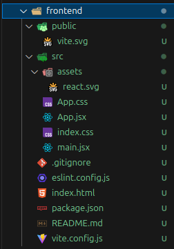
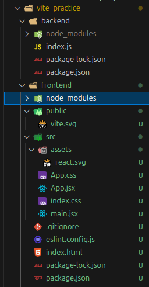

# Cheeses..

Dear visitor,

nothing to gain for you here.

Unless, of course, you’re an anthropologist with a soft spot for mental 'special effects.'

Just an embarrassingly nostalgic recap of once-familiar practices, now long vanished into oblivion - lost in the abyss of my deluded mind.

## 1. Creating Backend

```bash
# pre req.: mkdir backend;cd backend;touch index.js
# Initialize a Node.js Project; install express + dependencies
npm init -y
npm i express

# Create a simple express server by
# edit index.js, then start it with nodemon or
node index.js
```

check <http://localhost:5000/api>

## 2. Set Up the Frontend with React + Vite

```bash
# cd ..
npm create vite@latest frontend -- --template react
```

creates:



```bash
# cd frontend; install dependencies
npm i
```

adds node modules to frontend:



```bash
# App working? Check frontend development server by
npm run dev
```

should start react app @ <http://localhost:5173>
